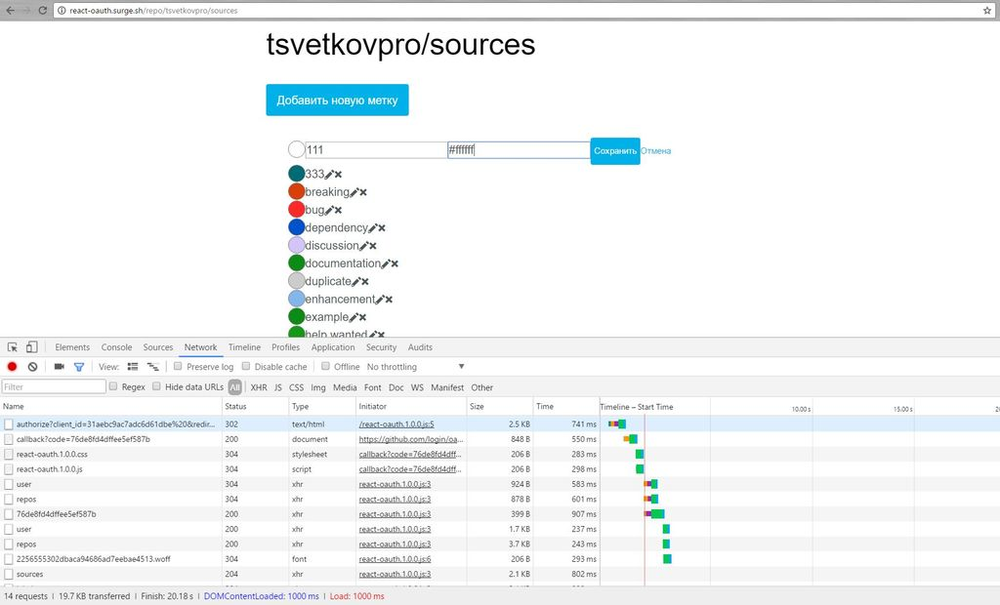

### Редактирование меток на github.com

 - **** Получение информации о репозиториях на сайте https://github.com/ и работа с API гитхаба.

#### Технологии
* Пример приложения: http://react-oauth.surge.sh/
* Babel.js
* React
* Ampersand.js
* Webpack
* YetiCSS
* Surge.sh

#### Интеграция с API гитхаба
* https://developer.github.com/v3/

#### Работа формой и отправка xhr-запросов

#### Развёртывание проекта
* https://heroku.com
* https://surge.sh

#### Получить помощь
* [Ваши пожелания и замечания к проекту](https://github.com/it-spectre-ru/react-api-github/pulls)

#### Смотрите также
* [Лицензия](./license.md)
